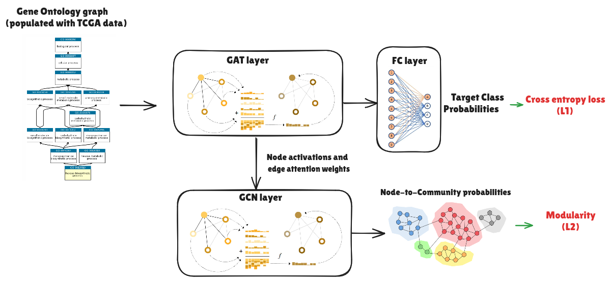

# OntologyGNN

Interpretable GNN model for ontology based data.

## 📊 Model Architecture



---

## Description

The model is Graph Neural Network based architecture to get output predictions for an Ontology based data task (classification/regression). It is also designed to detect important sub-graphs/communities within the ontology graph which are important for the model's predictions.

## Dataset

The code works with two data sources - the Titanic data for suvival prediction, and the TCGA gene expression data for cancer classification

TCGA dataset can be downloaded from [GDC portal](https://portal.gdc.cancer.gov/). 

## Usage

To work with the two supported datasets, structure your `data/` directory as follows:

```bash
data/
├── titanic/
│ ├── ontology_file # (ttl, rdf, or owl format)
│ └── feature-to-class_map (json)
  └── titanic data (csv)
├── tcga/
│ ├── matrix_connection_truncated.csv
│ ├── tcga.npz
│ └── tcga_graph.pickle
```


Make sure these files are placed exactly as shown to ensure compatibility with the `load_data'

### Config

We can change the model training and output settings in config.yaml

Description of some key params in config file

[Model hyperparameters]
hyperparams:
  num_communities: 3
  lambda: 1.0

[Experiments]
For tasks involving classification, we can specify if we want to analyze detected community structures for samples of a specific prediction label in:

interpretation_label:

If None, the code will analyze community structures for all samples

If we want to run the model some times, we can specify here:

repeat_analysis: (Default 1)

The output will then print the aggregated stats across all runs

#### To run with default configs (specified in config.yaml file)

```bash
python3 main.py
```

### Example on Titanic dataset:

#### Train

```bash
python3 main.py --dataset data/titanic --n_communities 3 --epochs 100
```

Optional - specify ontology or feature-to-class mappings files separately. If not provided, model will use default files based in config.yaml

```bash
python3 main.py --dataset data/titanic --n_communities 3 --epochs 100 --ontology_file ontology.ttl
```

### Example on TCGA dataset:


#### Train


```bash
python3 main.py --dataset data/TCGA --n_communities 3 --epochs 100
```


#### Train the model with a small number of training samples

```bash
python3 main.py --dataset data/TCGA --n_communities 3 --epochs 100 --n_samples 1000
```

#### To run on cluster

```bash
sbatch train_job.slurm
```

### Save model 

The code supports saving model checkpoints in the /checkpoints directory with the command argument

```bash
--save (True/False)
```
Alternatively, we can also specify it in config file

### Output

Output are logged in the log file (specified in config.yaml) in the form of:

-- Training/Test losses (prediction+modularity loss for train set, prediction loss for test set)

-- Model performance (Prediction accuracy for train/test set)

-- Community Importance (calculated as loss change per node for each community)+Most important community index

-- Top nodes in the most important community

-- Top edges within the most important community

##  Notebooks

Please see the notebook entitled *ontologyGNN.ipynb* (located in the notebooks directory) to run the model in a jupyter notebook. 